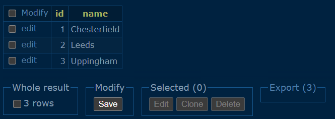

# BeanMeApp SuperCafe Project

## Contents

1. [Elevator Pitch](#elevator-pitch)
2. [Team Members](#team-members)
3. [Smart Goals](#smart-goals)
    - [Goal 1](#goal-1)
    - [Goal 2](#goal-2)
    - [Goal 3](#goal-3)
4. [Way of Working](#way-of-working)
    - [Team Name](#team-name)
    - [Development Process](#development-process)
    - [Definition of Done](#definition-of-done)
    - [Design Process](#design-process)
    - [Stand Up Time, Location, Structure](#stand-up-time-location-structure)
    - [Retro Time and Cadence](#retro-time-and-cadence)
    - [Team Principles](#team-principles)
    - [Tools](#tools)
    - [Notes on Code](#notes-on-code)
5. [Definition of Done (Tickets)](#definition-of-done-tickets)
6. [Directory Structure](#directory-structure)
7. [High-Level Component Diagram](#high-level-component-diagram)
8. [MoSCoW Diagram](#moscow-diagram)
9. [Importance (Flex)](#importance-flex)
10. [ER Diagram (3NF)](#er-diagram-3nf)
11. [ETL Pipeline Architecture](#etl-pipeline-architecture)
12. [AWS Architecture](#aws-architecture)
13. [Data in Postgres Database](#data-in-postgres-database)
    - [Transactions Table](#transactions-table)
    - [Baskets Table](#baskets-table)
    - [Locations Table](#locations-table)
14. [Grafana Demo](#grafana-demo)

## Elevator Pitch
As BeanMeApp, we’re tasked with building a scalable, automated ETL pipeline for our client, SuperCafe, a rapidly growing café chain with hundreds of outlets. Each night, transaction data in CSV files will be uploaded from every branch, and our system will extract, transform, and load this data into a centralized cloud-based data warehouse. From there, we’ll integrate with Grafana to provide real-time dashboards and reports, giving SuperCafe critical insights across all branches. We’ll utilize AWS services like S3 and Redshift to ensure everything is scalable and efficient. Our goal is to streamline SuperCafe's data processes, empower their decision-making, and support their rapid growth without relying on manual reporting.

## Team Members

- Iman Howard
- Mazin Ibrahim
- Atalay Erkul
- Nathan Grant
- Dario Li Causi
- Avi Bercovich  

## Smart Goals

### Goal 1
By the end of the first sprint (week 1), the BeanMeApp team will complete detailed UML diagrams, including system architecture, data flow, and the ETL pipeline components, to clearly outline the structure and flow of the data processing system.

### Goal 2
By the end of the second sprint (week 2), the team will design and implement the initial data ingestion process to read CSV files from SuperCafe branches and store them in a local or temporary storage system, ensuring error-free data capture for at least 3 branches.

### Goal 3
By the end of the second sprint (week 2), the team will define and implement basic data transformation rules to clean and structure the raw data, ensuring it is in a usable format for further processing in future sprints.

## Way of Working

### Team name: 

BeanMeApp
    
### Development process:

Agile Methodology (Scrum)

### Definition of done:

As per the Product Owner’s request, ‘done’ is no more than a working ETL pipeline with a Grafana data visualisation of some sort. 
    
### Design process: 
- Initial meetings
- Add/review/split tickets in GitHub Projects
- Review the CSV data
- Data modelling 
- Research
- Wireframing and initial design concepts
- Prototyping and Iteration
- Feedback and Refinement

### Stand up time, location, structure:

**Time:**

- When: Stand-ups will be held every morning at 9:00 AM (or another agreed-upon time, depending on your timezone and team preferences).

- Why: This gives everyone a clear start to the day, ensuring we’re all on the same page before diving into our tasks.

- Duration: The stand-up should take around 15 minutes max — just a quick sync to check in with each other.

**Where:** 

- We’ll conduct the stand-up virtually via Teams

**Structure:**

Each team member will answer the three main questions:

1. What did you accomplish yesterday?

2. What are you working on today?

3. Are there any blockers or challenges?

### Retro time and cadence:

Friday afternoons

### Team Principles: 

- Transparency
- Collaboration
- Proactive Problem-Solving
- Respect for Time
- Ownership and Accountability
- Continuous Learning and Feedback
- Empathy and Respect
- Eat as many Apricot Danish as we can!

### Tools:

- AWS S3 Bucket
- AWS Redshift
- AWS EC2
- AWS Lamda
- Python
- Github
- VS Code

### Notes on Code:

- Tabs are 4 spaces  
- A 5-line Python comment like below should be added to the top of each source file:  

```
# my_source_file.py  
#  
# WizzbangFeatureSuperMajorImportantCoolness  
#  
# DE Final Project week XX, April 2025, Guido van Rossum
```

- Import the _typing_ module and use type-hinting  
- When submitting a pull request make sure you've removed any and all 'testing' code you've commented-out.   
- Break long function argument lists into a vertical list, like so:  

```
def the_function(first_arg:  str,  
                 second_arg: int,  
                 third_arg:  list,  
                 fourth_arg: bool)
```

## Defenition of Done (Tickets)

All tasks at a given step of the project need to be expressed as a GitHub project ticket and each ticket processed as ‘done’. In the (likely) case of expressed tickets still being marked as ‘in progress’, a short comment as the reason of not doneness must be present.

## Directory structure

./doc       - Project documantation  
./data      - Data source files  
./src       - Applicaation source code  
./tooling   - Various helpers for project tooling  

## High-Level Component Diagram


## MoSCoW Diagram


## Importance (Flex)

.jpeg)

## ER Diagram (3NF)


## ETL Pipeline Architecture


## AWS Architecture


## Data in Postgres Database

**Transactions Table**


**Baskets Table**


**Locations Table**



## Grafana Demo

